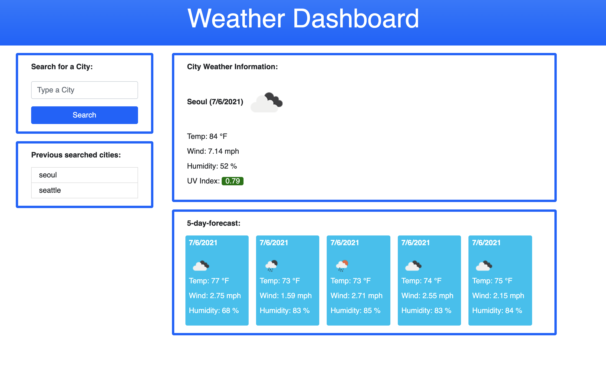

# Unit 06 HW: weather-dashboard

## Description
This project allows an user to search the weather information of specific city. The weather data is from the APIs provided by OpenWeather. From the API data, it collects the necessary weather information (weather condition, temperature, wind speed, humidity, and UV index) per user's input (city). User's searched city data is stored in local storage and the buttons get created as user adds more cities. When user clicks one of the searched city buttons, then user is displayed with its city weather information again.

## Tasks Assigned

```
- When user searches the city, it displays the current weather condition and 5-Day forecast weather condition.
- Then, the city that user searched is added to the search history.
- In current weather condition container, it displays the date, weather condition icon, temperature, wind speed, humidity, and UV index.
- Particularly, for UV index, I added color indicator based on the UV index level that provides user with important data.
- In 5-Day forecast weather condition container, it displays the date, weather condition icon, temperature, wind speed, and humidity for each day.
- When user clicks the searched city button, he/she is presented with weather information for that city again.
- As a developer, I need to utilize local storage data technique.
- I need to collect the weather data from OpenWeather API.
```

## Tasks Completed

```
User Story:
As A traveler, 
I WANT to see the weather outlook for multiple cities
SO THAT I can plan a trip accordinglys
```
- [x] Successfully utilized API keys to collect weather data from OpenWeather API
- [x] Successfully utilized local storage data method to manage the data
- [x] Successfully displays the city weather information for that day
- [x] Successfully displays the city weather information for 5-day forecast
- [x] Buttons for searched cities successfully stacks up and displays the weather information for that city again when user clicks the button
- [x] UV index is color coded based on the UV index level

## Screenshot of the Website



## Links

Deployed Website Link: [https://rhwlffk1028.github.io/weather-dashboard/](https://rhwlffk1028.github.io/weather-dashboard/)

Code Repository Link: [https://github.com/rhwlffk1028/weather-dashboard](https://github.com/rhwlffk1028/weather-dashboard)

> **Note**: Use the first link above to access the website. By clicking the deployed webiste link, you will be directed to the web browser and it will be viewable.<br>
> **Note**: Use the second link above to access the repository where the html, css, and image files are live.

## Copyright
---
Copyright (c) [2021] [Jun Choi] <br>
Confidential and Proprietary. All Rights Reserved.